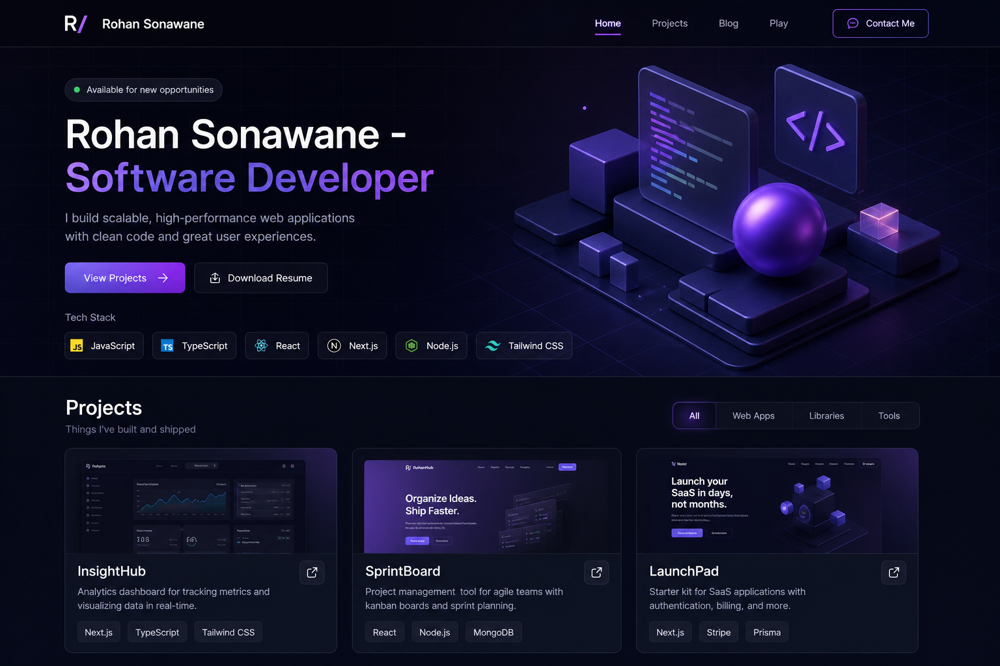

<div align="center">


<br />

<a href="https://www.youtube.com/watch?v=PLACEHOLDER" target="_blank" rel="noopener noreferrer">
  
</a>

<p><strong>▶ Click the preview to watch the site walkthrough on YouTube</strong><br/><sub>Replace <code>PLACEHOLDER</code> with your video ID when ready.</sub></p>

[](https://rohanverse.dev)
[](https://react.dev)
[](https://vitejs.dev)
[](https://threejs.org)
[](https://rohanverse.dev/play)

**[🚀 Enter RohanVerse](https://rohanverse.dev)** · **[🕹️ Play Arcade](https://rohanverse.dev/play)** · **[📚 Read Blog](https://rohanverse.dev/blog)** · **[🐛 Report Bug](https://github.com/rohansonawane/Portfolio/issues)**

</div>

---

## 🎮 Player Card

<table>
<tr>
<td width="50%" valign="top">

**Rohan Sonawane**  
`Class:` Software Developer  
`Realm:` Full Stack · AI/ML · VR/XR · Cloud  
`Build:` React + Vite + Three.js  
`Status:` 🟢 Online

</td>
<td width="50%" valign="top">

| Stat | Value |
|:--|--:|
| 🗂️ Projects | **8** |
| 📝 Blog Posts | **12** |
| 🕹️ Arcade Games | **12** |
| 🗺️ Prerendered Routes | **36+** |
| 🌗 Theme Modes | **2** |

</td>
</tr>
</table>

---

## ⚡ Skill Tree

| Skill | Level | XP |
|:--|:--|:--|
| React / Router | `██████████` | **100** |
| Vite / Build | `█████████░` | **92** |
| Three.js / 3D | `████████░░` | **84** |
| SEO / Prerender | `████████░░` | **86** |
| Markdown Blog | `█████████░` | **90** |
| Arcade Systems | `██████████` | **100** |

---

## 🏆 Achievements Unlocked

| Badge | Achievement | How to earn |
|:--:|:--|:--|
| 🌌 | **Verse Explorer** | Open the 3D hero homepage |
| 📁 | **Case Study Hunter** | Read a `/project/:slug` page |
| 📖 | **Blog Grinder** | Finish a long-form tech article |
| 🕹️ | **Arcade Regular** | Win a game in Notebook Arcade |
| 🤖 | **AI Challenger** | Beat CPU mode in a strategy game |
| 🔍 | **SEO Speedrun** | Deploy with prerender + sitemap |

---

## 🗺️ World Map

| Zone | Route | What you get |
|:--|:--|:--|
| 🏠 **Home Base** | `/` | 3D hero, skills, projects, experience, contact |
| 📁 **Project Vault** | `/project/:slug` | Deep-dive case studies |
| 📚 **Tech Library** | `/blog` | 12 Markdown articles |
| 📄 **Scroll Room** | `/blog/:slug` | TOC, reading progress, share row |
| 🕹️ **Notebook Arcade** | `/play` | 12 pencil-and-paper games |
| 🎯 **Game Arena** | `/play/:gameId` | Individual arcade titles |

---

## 🕹️ Arcade Roster

| Game | Mode | Difficulty |
|:--|:--|:--|
| Tic Tac Toe | 2P · Vs CPU | Easy → Unbeatable |
| Sudoku | Solo · AI Assist | Easy → Hard |
| Snake | Solo · AI Play | Speed tiers |
| Dots & Boxes | 2P · Vs CPU | Easy → Hard |
| SOS | 2P · Vs CPU | Line scoring + CPU |
| Hangman | Solo · AI Assist | Word lengths |
| Sea Battle | Vs CPU | Ship placement |
| Minesweeper | Solo · AI Assist | Grid sizes |
| Drop Dots | 2P · Vs CPU | Connect-four style |
| Doodle Maze | Solo · AI Assist | Procedural mazes |
| Word Search | Solo · AI Assist | 3 themes |
| Book Cricket | 1P · 2P | Notebook classic |

> Scores persist in `localStorage`. Sound + theme live in arcade settings.

---

## 📜 Quest Log

### Quest 1 — Spawn Locally

```bash
git clone https://github.com/rohansonawane/Portfolio.git
cd Portfolio
npm install
npm run dev
```

`Reward:` Local dev server at [http://localhost:5173](http://localhost:5173)

### Quest 2 — Build for Production

```bash
npm run build
npm run preview
```

`Reward:` `dist/` output + prerendered SEO routes + fresh `sitemap.xml`

### Quest 3 — Boss Fight: Deploy on Vercel

| Setting | Value |
|:--|:--|
| Framework | **Vite** |
| Build Command | `npm run build` |
| Output Directory | `dist` |
| Install Command | `npm install --include=dev` |

`Reward:` Live portfolio at your custom domain

### Optional Buff — Canonical URL

```bash
VITE_SITE_URL=https://yourdomain.com npm run build
```

---

## 🧱 Loadout (Tech Stack)

<table>
<tr>
<td width="33%" valign="top">

**Frontend**  
React 18  
React Router 7  
Custom CSS system  
Light / dark theme

</td>
<td width="33%" valign="top">

**Experience**  
Three.js hero  
react-markdown blog  
react-helmet-async SEO  
Lazy-loaded arcade

</td>
<td width="33%" valign="top">

**Pipeline**  
Vite 6  
Route prerender script  
Sitemap + robots.txt  
Vercel SPA rewrites

</td>
</tr>
</table>

---

## 📦 Inventory (Project Structure)

```
├── src/
│   ├── pages/              # Route pages
│   ├── components/         # Layout, blog, arcade, SEO
│   ├── content/blog/       # Markdown posts
│   ├── arcade/             # Game logic + registry
│   ├── lib/                # Projects, blog manifest
│   ├── styles/             # portfolio + arcade CSS
│   └── three/              # 3D hero scene
├── public/assets/          # Images, GLB model, blog art
├── scripts/prerender.mjs   # Post-build SEO pass
├── docs/images/            # README assets
├── archive-portfolio/      # Legacy Next.js build
└── vercel.json
```

---

## 🗃️ Archive Zone

The previous **Next.js 14** portfolio is preserved in [`archive-portfolio/`](./archive-portfolio/) — same universe, earlier build.

---

## 👤 Creator

**Rohan Sonawane**

[](https://rohanverse.dev)
[](https://github.com/rohansonawane)
[](https://www.linkedin.com/in/rohansonawane)
[](mailto:rohansonawane28@gmail.com)

---

<div align="center">

<sub>Built with React · Vite · Three.js · and a lot of notebook nostalgia</sub>

**Rohan<span style="color:#4f55ff">Verse</span>** — press start to explore.

</div>
