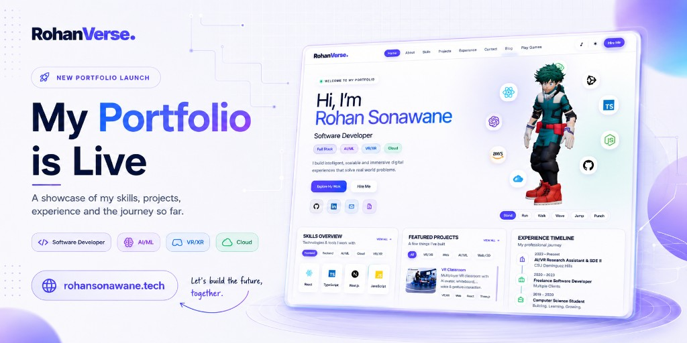

<div align="center">



[](https://rohanverse.dev)
[](https://react.dev)
[](https://vitejs.dev)
[](https://threejs.org)
[](https://rohanverse.dev/play)

**[Live Demo](https://rohanverse.dev)** · **[Arcade](https://rohanverse.dev/play)** · **[Blog](https://rohanverse.dev/blog)** · **[Issues](https://github.com/rohansonawane/Portfolio/issues)**

</div>

---

## About

**RohanVerse** is a modern developer portfolio engineered as a single, cohesive product: a cinematic **3D homepage**, structured **project case studies**, a **technical blog**, and an interactive **Notebook Arcade**. It is built for performance, discoverability, and long-term maintainability, with production-ready SEO, responsive layouts, and a distinctive glass-and-grid design system.

The earlier Next.js version is preserved in [`archive-portfolio/`](./archive-portfolio/) for reference.

---

## At a Glance

<table>
<tr>
<td width="50%" valign="top">

**Built by:** Rohan Sonawane  
**Role:** Software Developer  
**Focus:** Full Stack · AI/ML · VR/XR · Cloud  
**Stack:** React · Vite · Three.js  
**Deployment:** Vercel-ready

</td>
<td width="50%" valign="top">

| Metric | Count |
|:--|--:|
| Project case studies | **8** |
| Technical articles | **12** |
| Arcade games | **12** |
| Prerendered routes | **36+** |
| Theme modes | **2** |

</td>
</tr>
</table>

---

## What Makes It Different

Most portfolios stop at a landing page. RohanVerse is designed as a small platform:

- **Immersive first impression** — Three.js hero scene with optimized 3D assets
- **Credible project depth** — Dedicated case-study pages with features, stack, and outcomes
- **Thought leadership** — Markdown blog with reading progress, TOC, and share tooling
- **Memorable interaction** — Notebook Arcade adds personality without sacrificing polish
- **Search and social ready** — Route-level prerendering, sitemap, robots.txt, and Open Graph support
- **Accessible UX** — Light/dark themes, responsive shell, lazy-loaded routes

---

## Platform Map

| Section | Route | Description |
|:--|:--|:--|
| **Home** | `/` | Hero, skills, featured work, experience, and contact |
| **Projects** | `/project/:slug` | In-depth case studies across AI, VR, and full-stack work |
| **Blog** | `/blog` | Curated library of technical writing |
| **Articles** | `/blog/:slug` | Long-form posts with TOC, progress bar, and related reads |
| **Arcade Hub** | `/play` | Collection of browser-based notebook games |
| **Games** | `/play/:gameId` | Individual arcade experiences with settings and scoring |

---

## Notebook Arcade

A set of 12 polished browser games inspired by pencil-and-paper classics, integrated directly into the portfolio experience.

| Game | Modes | Notes |
|:--|:--|:--|
| Tic Tac Toe | 2 Players · Vs CPU | Multiple board sizes and difficulty tiers |
| Sudoku | Solo · AI Assist | Puzzle generation with hint support |
| Snake | Solo · AI Play | Adjustable speed and grid size |
| Dots & Boxes | 2 Players · Vs CPU | Strategic line-drawing gameplay |
| SOS | 2 Players · Vs CPU | Score tracking with visual line highlights |
| Hangman | Solo · AI Assist | Difficulty-based word sets |
| Sea Battle | Vs CPU | Ship placement and turn-based combat |
| Minesweeper | Solo · AI Assist | Scalable boards and mine density |
| Drop Dots | 2 Players · Vs CPU | Connect-style strategy |
| Doodle Maze | Solo · AI Assist | Procedurally generated mazes |
| Word Search | Solo · AI Assist | School, tech, and nature themes |
| Book Cricket | 1 Player · 2 Players | Notebook-style number game |

Arcade scores and preferences persist locally. Sound and theme settings are configurable from the arcade UI.

---

## Technical Highlights

<table>
<tr>
<td width="33%" valign="top">

**Application Layer**  
React 18  
React Router 7  
Component-driven layout  
Custom CSS design tokens  
Light / dark theme support

</td>
<td width="33%" valign="top">

**Experience Layer**  
Three.js portfolio hero  
Markdown blog pipeline  
Helmet-based metadata  
Lazy-loaded game modules  
Interactive contact and skills UI

</td>
<td width="33%" valign="top">

**Delivery Layer**  
Vite 6 build pipeline  
Post-build prerender script  
Sitemap and robots generation  
Code splitting by route and feature  
Vercel SPA configuration

</td>
</tr>
</table>

### Stack Proficiency

| Area | Coverage |
|:--|:--|
| React / Routing | `██████████` Production-grade SPA architecture |
| Build / Tooling | `█████████░` Vite with optimized chunking |
| 3D / WebGL | `████████░░` Interactive hero with GLB assets |
| SEO / Discovery | `████████░░` Static route HTML + metadata |
| Content Systems | `█████████░` Markdown blog with manifest-driven routing |
| Interactive Features | `██████████` Full arcade subsystem with AI modes |

---

## Quick Start

### 1. Clone and run locally

```bash
git clone https://github.com/rohansonawane/Portfolio.git
cd Portfolio
npm install
npm run dev
```

Open [http://localhost:5173](http://localhost:5173).

### 2. Create a production build

```bash
npm run build
npm run preview
```

This generates the `dist/` output and runs the prerender step for SEO-friendly route HTML, `sitemap.xml`, and `robots.txt`.

### 3. Deploy to Vercel

| Setting | Value |
|:--|:--|
| Framework Preset | **Vite** |
| Build Command | `npm run build` |
| Output Directory | `dist` |
| Install Command | `npm install --include=dev` |

### Environment variable

| Variable | Purpose | Default |
|:--|:--|:--|
| `VITE_SITE_URL` | Canonical domain for meta tags, sitemap, and robots | `https://rohanverse.dev` |

```bash
VITE_SITE_URL=https://yourdomain.com npm run build
```

---

## Project Structure

```
├── src/
│   ├── pages/              # Route-level views
│   ├── components/         # Layout, blog, arcade, and SEO components
│   ├── content/blog/       # Markdown source files
│   ├── arcade/             # Game logic and registry
│   ├── lib/                # Projects data, blog manifest, init scripts
│   ├── styles/             # Portfolio and arcade stylesheets
│   └── three/              # Three.js hero implementation
├── public/assets/          # Images, 3D model, blog media, arcade art
├── scripts/prerender.mjs   # Post-build SEO prerender
├── docs/images/            # README and documentation assets
├── archive-portfolio/      # Archived Next.js portfolio
└── vercel.json             # Deployment configuration
```

---

## Archive

The legacy **Next.js 14** portfolio remains available in [`archive-portfolio/`](./archive-portfolio/) for comparison and historical reference. It is excluded from the active deployment.

---

## Author

**Rohan Sonawane**  
Software Developer building intelligent, scalable, and immersive products across full-stack engineering, AI, and XR.

[](https://rohanverse.dev)
[](https://github.com/rohansonawane)
[](https://www.linkedin.com/in/rohansonawane)
[](mailto:rohansonawane28@gmail.com)

---

<div align="center">

<sub>React · Vite · Three.js · Built for clarity, depth, and craft.</sub>

**Rohan<span style="color:#4f55ff">Verse</span>**

</div>
