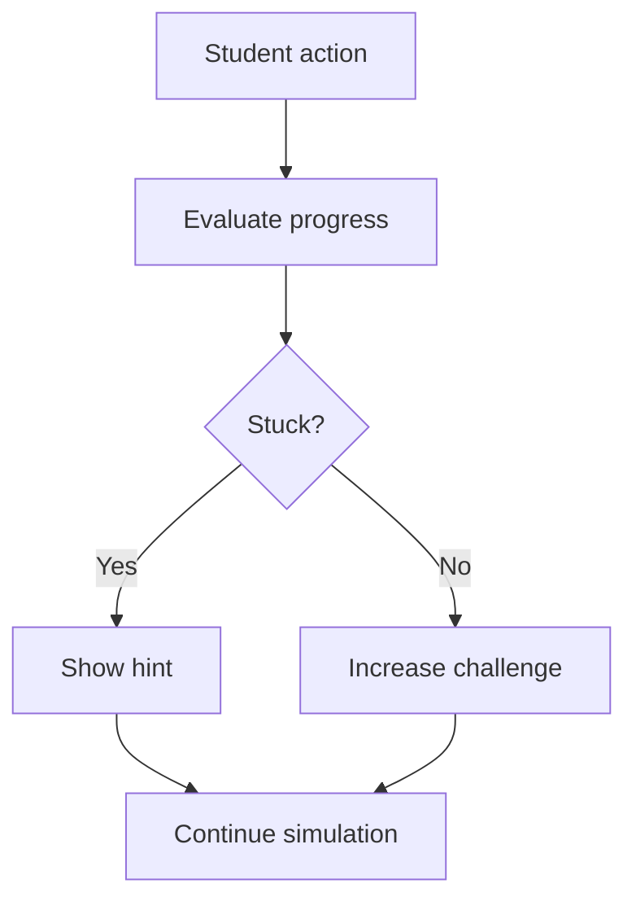

## VR needs more than 3D assets

A VR experience feels alive when it understands the user. Traditional VR development focuses on scenes, controllers, interaction, physics, locomotion, and performance. AI adds another layer: adaptation. It allows the experience to respond to what the user is doing, what they are struggling with, and what they are trying to learn.

This is especially powerful in education, simulation, and training. A VR chemistry lab can detect that a student is picking the wrong tool. A VR public speaking simulator can adjust audience behavior. A VR anatomy room can answer questions about organs through a voice assistant. A VR classroom can personalize hints without the teacher manually watching every student.

## AI use cases in VR

### 1. AI tutors and guides

The most direct use case is an AI guide inside the VR scene. This can be a floating assistant, a virtual teacher, or an NPC. The assistant can explain the next step, answer questions, and summarize what the user just did.

For a VR education app, this is extremely useful because students often get stuck not because the content is hard, but because they do not know what to do next in the 3D space.

### 2. Adaptive learning

AI can adjust difficulty based on user behavior. If a student completes a task quickly, the simulation can introduce a harder version. If the student struggles, it can reduce complexity or show hints.

Example:

### 3. Smarter NPCs

Traditional NPCs follow scripts. AI NPCs can react to user actions and generate more natural dialogue. In VR training, this is valuable for medical interviews, customer service, safety training, and classroom roleplay.

The key is to constrain the NPC. A medical patient NPC should not talk like a general chatbot. It should stay within the symptoms, history, and learning objectives of the scenario.

### 4. Procedural content generation

AI can help generate textures, props, dialogue, quiz questions, scene layouts, and practice scenarios. Developers should still review the final output, but AI can speed up iteration dramatically.

For example, an amusement park VR project can use AI to generate ride names, game instructions, environment variations, and challenge cards.

### 5. On-device inference

VR performance is sensitive. Network latency can break immersion. That is why on-device inference matters. When smaller models run locally inside the app, they can support gesture recognition, pose interpretation, simple behavior prediction, and visual classification without constantly calling the cloud.

Cloud AI is still useful for heavier language reasoning, but not every AI feature should depend on a server call.

## Architecture for AI-powered VR

A practical AI VR system can be split into three parts:

- **Scene layer:** Unity/Unreal objects, interactions, physics, UI, locomotion.
- **AI layer:** tutor, hint engine, NPC dialogue, analytics, recommendation logic.
- **Data layer:** user progress, lesson state, knowledge base, event logs.

The mistake is to put all AI logic directly inside scene scripts. Keep AI services modular so the VR scene can call them without becoming messy.

## Example: AI tutor for a VR microscope

Imagine a VR biology microscope lab. The student can change slides, zoom in, adjust focus, and identify cell structures. The AI tutor can:

- Detect what slide is active.
- Explain what the student is seeing.
- Ask checkpoint questions.
- Give hints if the student zooms incorrectly.
- Summarize the completed observation.

This creates a stronger learning loop than a static label system.

## Design principles

1. **Do not interrupt immersion.** AI should help without constantly popping up.
2. **Prefer short hints.** In VR, long text is uncomfortable.
3. **Use voice when possible.** Voice is natural in immersive spaces.
4. **Keep control with the user.** Let students request help instead of forcing it every second.
5. **Log learning events.** Track what students did, not just whether they completed the task.

## Key takeaways

- AI makes VR more adaptive, interactive, and educational.
- AI tutors, NPCs, hints, and analytics are the highest-value use cases.
- On-device inference matters for low-latency VR features.
- Keep AI services modular instead of hardcoding everything in scene scripts.

## FAQ

**Should VR AI run locally or in the cloud?**
Use local inference for fast, lightweight perception tasks. Use cloud AI for heavier reasoning, long-form explanations, and content generation.

**Can AI create entire VR scenes?**
It can assist with assets, scripts, and layouts, but a developer still needs to optimize performance, interactions, and user experience.

**What is the best first AI feature for a VR education app?**
Start with a hint system or guided tutor. It improves usability immediately.

## Conclusion

AI will not replace VR developers. It will change what good VR developers can build. The future of VR is not only realistic graphics. It is responsive worlds that understand learners, adapt to behavior, and make immersive experiences easier to build and easier to learn from.
