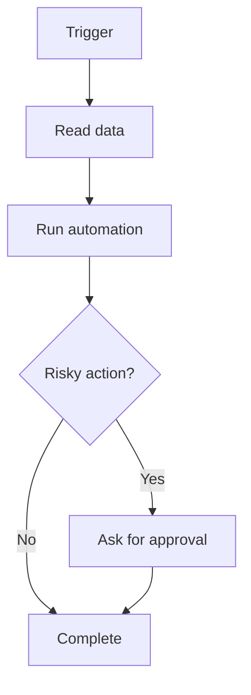

## Automation should remove friction, not create chaos

Automation is powerful, but bad automation is worse than no automation. A script that silently breaks production, sends the wrong email, or deletes the wrong file can cost more time than it saves.

Good automation has a simple rule: automate repetitive low-risk steps first, and add approval gates for high-risk steps.

## What to automate first

Start with tasks that are frequent, boring, and easy to verify:

- Formatting code.
- Running tests.
- Creating project folders.
- Generating release notes.
- Backing up files.
- Creating draft emails.
- Labeling issues.
- Sending daily summaries.
- Updating documentation from templates.

Do not start by automating production deploys if your manual process is not stable.

## The automation ladder

### Level 1: Checklists

Before writing scripts, write the process as a checklist. This exposes hidden steps.

### Level 2: Shell scripts

Once the checklist is stable, automate the most repetitive commands.

```bash
#!/usr/bin/env bash
set -e
npm install
npm run lint
npm test
npm run build
```

### Level 3: GitHub Actions

Move repeatable project checks into CI so every pull request gets the same verification.

### Level 4: Workflow tools

Use tools like n8n when the workflow crosses apps: Gmail, Slack, Notion, Google Sheets, GitHub, databases, and webhooks.

### Level 5: AI-assisted workflows

Add AI when the task requires interpretation, summarization, classification, or drafting. Keep approval for anything public, expensive, or destructive.

## Examples of useful automations

### Blog publishing automation

- Trigger: new Markdown file in `/blogs`.
- Action: check metadata.
- Action: generate SEO summary.
- Action: create CMS draft.
- Approval: human reviews before publishing.

### Job application automation

- Trigger: saved job link.
- Action: extract role requirements.
- Action: compare against resume.
- Action: draft tailored bullet suggestions.
- Approval: human edits before applying.

### Development automation

- Trigger: pull request opened.
- Action: run tests.
- Action: check changed files.
- Action: generate review checklist.
- Approval: developer merges after review.

## Where AI fits

AI is best when the workflow includes messy text or judgment:

- Summarize an email thread.
- Classify customer feedback.
- Draft a pull request description.
- Generate test ideas.
- Review logs for likely causes.
- Turn meeting notes into tasks.

AI is risky when the action is irreversible. Never let an AI workflow delete production data, publish public content, or spend money without approval.

## Automation design principles

1. **Make it visible.** Log what happened.
2. **Make it reversible.** Prefer drafts over sends, archive over delete, preview over apply.
3. **Use small steps.** One automation should do one clear job.
4. **Add failure messages.** Silent failures are dangerous.
5. **Keep secrets safe.** Do not hardcode API keys.
6. **Review regularly.** Workflows become outdated as tools change.

## Workflow diagram



## Key takeaways

- Automate stable processes first.
- Use AI for interpretation and drafting, not blind destructive action.
- Add approval gates for risky steps.
- Keep logs, retries, and failure alerts.
- Good automation feels boring because it is reliable.

## FAQ

**What is the easiest first automation?**
A test/build script or a daily summary workflow is a good start.

**Should I use n8n or code?**
Use code for developer workflows and n8n for cross-app workflows. Many teams use both.

**Can AI fully automate my work?**
It can automate pieces, but the best workflows keep humans in control of final decisions.

## Conclusion

Automation should make your workflow calmer. Start small, keep it visible, and add human approval where mistakes matter. The goal is not to automate everything. The goal is to remove repeated friction so you can focus on better work.
