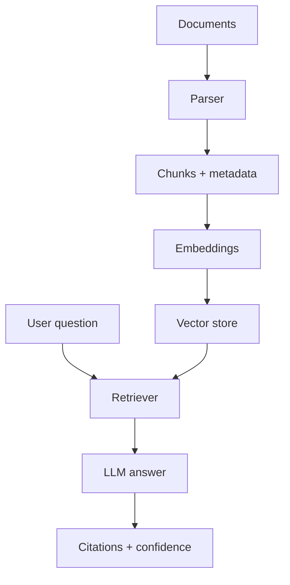

## RAG is more than adding a vector database

Retrieval-Augmented Generation, or RAG, is a pattern where an AI system retrieves relevant information before generating an answer. It is useful because models do not automatically know your private documents, product docs, codebase, or latest internal notes.

But a RAG app can still fail. It can retrieve the wrong context, ignore the right context, hallucinate unsupported claims, or cite irrelevant sources. A trustworthy RAG app needs careful engineering.

## The basic pipeline

A RAG system usually has these steps:

1. Collect documents.
2. Clean and normalize them.
3. Split them into chunks.
4. Generate embeddings.
5. Store chunks and vectors.
6. Retrieve relevant chunks for a question.
7. Generate an answer using retrieved context.
8. Show citations.
9. Evaluate whether the answer is correct.

The quality of each step affects the final answer.

## Chunking matters

Chunking is the process of splitting documents into smaller pieces. If chunks are too small, they lose context. If chunks are too large, retrieval becomes noisy.

Good chunks should preserve meaning. For technical documents, split by headings when possible. For PDFs, preserve page numbers. For code, split by functions, classes, or files.

## Retrieval is not just similarity

Vector similarity is useful, but it is not always enough. Many production RAG systems combine:

- Vector search for semantic meaning.
- Keyword search for exact terms.
- Metadata filters for project, date, user, or document type.
- Reranking to improve result order.

Example: if a user asks about "OPT reporting deadline," exact terms and dates matter. Pure semantic retrieval may miss the most precise chunk.

## Citations make answers usable

A RAG answer should show where the information came from. Citations are not decoration. They let users verify the answer and build trust.

A good citation points to a specific document section, page, or line range. A vague source link is better than nothing, but precise citations are much stronger.

## Evaluation is required

Do not judge a RAG app by a few good demos. Create a test set of real questions and expected answers. Track:

- Retrieval precision.
- Answer correctness.
- Citation correctness.
- Unsupported claims.
- Latency.
- Cost per answer.

If your RAG app is for legal, medical, financial, or immigration information, evaluation and disclaimers become even more important.

## Simple RAG architecture

## Common mistakes

- Ingesting messy PDFs without checking extracted text.
- Storing chunks without source metadata.
- Using only vector search when exact search matters.
- Letting the model answer without retrieved context.
- Showing citations that do not support the claim.
- Skipping evaluation.

## Key takeaways

- RAG quality depends on ingestion, chunking, retrieval, prompting, and evaluation.
- Always store metadata with chunks.
- Use citations that actually support the answer.
- Combine vector and keyword retrieval when precision matters.
- Build a test set early.

## FAQ

**Do I need RAG for every AI app?**
No. Use RAG when the answer depends on private, changing, or source-specific knowledge.

**Which database should I use?**
Start with the database that fits your scale and team. Postgres with vector support is enough for many early products.

**Can RAG eliminate hallucinations?**
It reduces hallucinations, but it does not eliminate them. You still need guardrails and evaluation.

## Conclusion

A trustworthy RAG app is not just a chatbot over files. It is a retrieval system, citation system, and evaluation system around a language model. Build those pieces well and users will trust the answers more.
