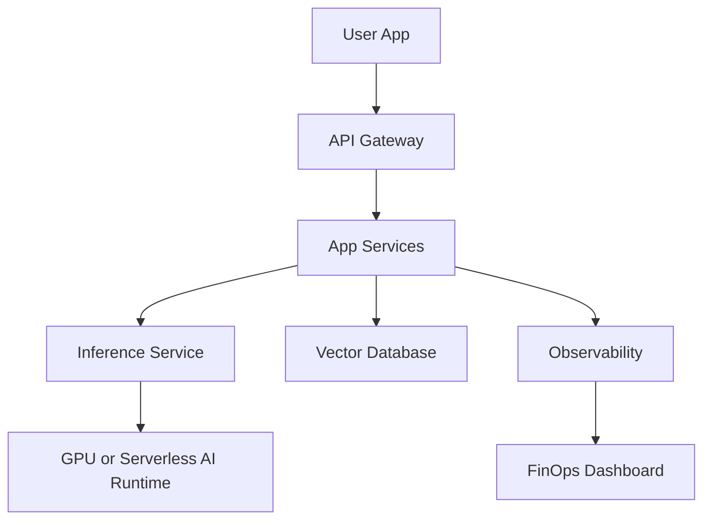

## The cloud is becoming an AI platform

Cloud computing used to be mostly about servers, storage, databases, and deployment. In 2026, the cloud is increasingly about running AI workloads reliably: inference, embeddings, vector search, agents, batch jobs, and GPU-heavy pipelines.

The important trend is not "everything is AI." The important trend is that AI workloads are forcing teams to improve scheduling, observability, cost management, and platform engineering.

## 1. Kubernetes as the AI operating layer

Kubernetes is not just for microservices anymore. It is becoming a common layer for AI infrastructure because teams need to schedule containers, attach GPUs, scale workloads, manage secrets, deploy inference services, and monitor production systems.

For developers, this means Kubernetes knowledge is still valuable, but the focus is shifting. It is less about manually writing every YAML file and more about using platforms, templates, and operators that hide complexity.

## 2. Specialized hardware scheduling

AI workloads need GPUs and other accelerators. That makes resource scheduling harder. Traditional CPU and memory scheduling is not enough. Teams need to decide which workloads get which hardware, how to share devices, and how to avoid waste.

Dynamic Resource Allocation in Kubernetes is part of this larger trend: cloud systems must understand specialized hardware better.

## 3. Serverless AI and edge inference

Serverless used to mean functions. Now it increasingly includes AI inference. Developers want to run models without managing servers, especially for prototypes, lightweight inference, and event-driven workloads.

Edge AI is also growing because latency matters. If the user is far from the model, every interaction feels slower. Running smaller models closer to users can improve speed and reduce infrastructure complexity.

## 4. Platform engineering

Platform engineering is the practice of building internal tools that make developers more productive. Instead of every team reinventing CI/CD, secrets, deployment, monitoring, and cloud setup, a platform team creates golden paths.

A good platform gives developers:

- Approved templates.
- Self-service environments.
- Standard observability.
- Secure deployment defaults.
- Cost visibility.

This matters because modern cloud systems are too complex for every developer to build from scratch each time.

## 5. FinOps for AI spend

Cloud cost management is becoming more important because AI workloads can become expensive quickly. A small bug in a normal API can waste some compute. A small bug in a GPU inference loop can waste serious money.

FinOps is about connecting engineering decisions to business value. Developers should understand cost per request, cost per training job, cost per customer, and cost per feature.

## 6. Observability for distributed AI systems

Traditional logs are not enough for AI systems. Teams need to observe:

- Model latency.
- Tool calls.
- Token usage.
- Retrieval quality.
- Failed agent steps.
- User feedback.
- Cost per workflow.

Cloud observability must now include both software signals and AI-specific signals.

## Cloud architecture example

## Skills developers should learn

- Containers and Docker fundamentals.
- Kubernetes basics and managed Kubernetes.
- Serverless patterns.
- Observability: logs, metrics, traces.
- Infrastructure as code.
- Cloud security basics.
- Cost-aware architecture.
- AI inference deployment patterns.

## Key takeaways

- The cloud is becoming the runtime for AI products.
- Kubernetes remains important, especially for production AI workloads.
- Serverless AI and edge inference reduce operational overhead.
- Platform engineering helps teams move faster safely.
- FinOps is now a developer concern, not only a finance concern.

## FAQ

**Do all developers need Kubernetes?**
Not deeply, but understanding the basics helps you reason about modern deployment systems.

**Is serverless better than containers?**
Neither is always better. Serverless is great for event-driven and elastic workloads. Containers are better when you need more control.

**Why does FinOps matter to developers?**
Because code choices create cloud bills. Efficient architecture is part of professional engineering.

## Conclusion

The most important cloud trend is maturity. Teams are moving from "deploy it somehow" to reliable platforms, cost visibility, AI runtime support, and developer self-service. Developers who understand these trends will build systems that are easier to scale and easier to operate.
