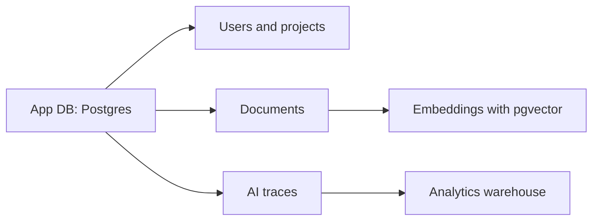

## Databases are changing because apps are changing

Modern applications are not only storing users, posts, orders, and payments. They are storing embeddings, conversations, events, analytics, documents, AI traces, and real-time collaboration state. That changes what developers need from a database.

The biggest database trend is not that one database will replace all others. The trend is that developers want fewer moving pieces, better scalability, safer workflows, and AI-ready search.

## 1. Vector search inside familiar databases

Vector search allows applications to find semantically similar items. Instead of matching only exact keywords, a vector search can find content that means something similar.

This is essential for Retrieval-Augmented Generation, recommendation systems, semantic document search, and AI assistants.

The practical trend is that many teams prefer adding vector search to a database they already know instead of managing a separate vector database immediately. Postgres with pgvector is a popular example because teams can keep relational data and embeddings close together.

## 2. Serverless Postgres

Serverless databases are attractive because developers want automatic scaling, simpler operations, and lower idle cost. Serverless Postgres platforms aim to keep the relational model while reducing infrastructure management.

Good use cases:

- SaaS apps.
- Prototypes.
- Internal tools.
- AI apps with variable traffic.
- Branch-based development workflows.

## 3. Database branching

Database branching brings a Git-like idea to data. Developers can create isolated database branches for testing, preview environments, migrations, and pull requests.

This is powerful because many bugs happen when schema changes meet real data. Branching makes it easier to test migrations safely before touching production.

## 4. Lakehouse and open table formats

Large analytics systems need a reliable way to manage data files, schema evolution, partitioning, and time travel. Open table formats like Apache Iceberg help bring database-like reliability to huge analytic datasets.

The value is practical:

- Safer schema evolution.
- Snapshot-based reads.
- Time travel.
- Multiple engines reading the same table format.
- Better long-term data interoperability.

## 5. Distributed SQL

Distributed SQL databases combine relational SQL with distributed architecture. They are designed for systems that need stronger consistency, global availability, or horizontal scale.

Not every app needs distributed SQL. But if your users are global, your uptime needs are high, or your data residency requirements are complex, distributed SQL becomes more relevant.

## 6. Hybrid analytics

Hybrid analytics lets developers work across local and cloud execution. The goal is to keep the developer experience simple while using cloud power when data or compute needs grow.

This matters for data apps because developers often want fast local iteration without giving up access to shared cloud datasets.

## Database choice by use case

| Use case | Good fit |
| --- | --- |
| Standard SaaS app | Postgres |
| AI semantic search | Postgres + pgvector or vector DB |
| Global transactional app | Distributed SQL |
| Huge analytics tables | Iceberg-based lakehouse |
| Fast local analytics | DuckDB-style local analytics |
| Preview environments | Database branching |

## Example AI app database architecture

## What developers should learn

- SQL fundamentals.
- Indexing and query plans.
- Transactions and isolation.
- Vector search basics.
- Schema migration strategy.
- Backup and recovery.
- Multi-region tradeoffs.
- Data modeling for AI features.

## Key takeaways

- Vector search is becoming a normal part of application architecture.
- Serverless databases reduce operational work but still need good schema design.
- Database branching improves developer workflow.
- Open table formats matter for analytics durability.
- Distributed SQL is powerful but should match a real requirement.

## FAQ

**Do I need a dedicated vector database?**
Not always. For many apps, Postgres plus vector support is enough. Dedicated vector databases may help at larger scale or specialized retrieval needs.

**Is NoSQL dead?**
No. NoSQL remains useful for flexible document models, key-value workloads, and specific scaling needs. The trend is better matching the database to the workload.

**What database should a beginner learn first?**
Learn SQL and Postgres first. It gives you strong foundations for most backend work.

## Conclusion

The future of databases is practical, not trendy. Developers want reliable relational data, semantic search, analytics, branching, and scale without creating unnecessary complexity. The best database choice is the one that matches your product's most important data operations.
