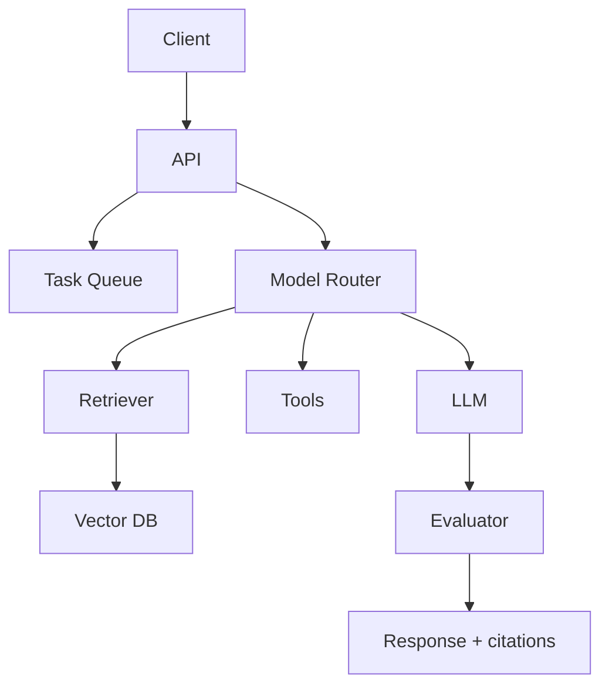

## AI-native apps have different failure modes

A normal app usually fails in visible ways: a request times out, a database query fails, or a page crashes. AI-native apps can fail more subtly. They can return a confident but wrong answer, use the wrong tool, retrieve irrelevant context, or spend too much money on a simple task.

That means system design for AI apps must include quality, cost, latency, and safety from the beginning.

## Core components

### 1. Product interface

The interface can be a chat panel, command palette, form, workflow builder, IDE assistant, or embedded agent. The interface should make the user's goal clear and show what the AI is doing.

### 2. API and auth layer

AI features still need normal engineering: authentication, rate limits, tenant boundaries, permissions, and audit logs.

### 3. Model router

Not every task needs the most powerful model. A model router can choose based on task type, cost, latency, and risk.

Examples:

- Small model for classification.
- Larger model for reasoning.
- Vision model for image input.
- Code model for code generation.

### 4. Retrieval and memory

AI apps need context. Retrieval brings in source documents. Memory stores useful user or project state. Keep these separate. Retrieval answers "what sources are relevant?" Memory answers "what stable facts should the app remember?"

### 5. Tool execution

Tool calls should be typed, validated, and logged. The model should not directly perform dangerous actions. Use approval gates when actions affect money, production, private data, or public publishing.

### 6. Queues for long tasks

Many AI workflows take time: document processing, code generation, report creation, video analysis, batch summarization. Use queues instead of blocking the user request.

### 7. Observability

AI observability includes normal metrics plus AI-specific data:

- Prompt version.
- Model used.
- Input and output size.
- Retrieval results.
- Tool calls.
- Latency.
- Cost.
- User feedback.

## Example architecture

## Design patterns

### Human-in-the-loop

Use this when mistakes are expensive. The AI drafts, the human approves.

### Generate-then-verify

Use this when output can be checked automatically. Example: generate code, then run tests.

### Retrieve-then-answer

Use this when the answer depends on source material.

### Cache repeated work

Cache embeddings, summaries, classifications, and deterministic outputs. Do not repeatedly pay for the same operation.

### Decompose long workflows

Break big tasks into steps that can be retried and inspected.

## Common mistakes

- Sending every request to the largest model.
- Not tracking cost per feature.
- Mixing private tenant data in retrieval.
- Skipping logs for tool calls.
- Letting AI write directly to production systems.
- Ignoring latency until launch.

## Key takeaways

- AI-native apps need model routing, retrieval, queues, evaluation, and observability.
- Cost and quality are architecture concerns.
- Human approval is a feature, not a weakness.
- The safest AI systems make actions visible and reversible.

## FAQ

**What is the first system design concern for AI apps?**
Data boundaries. Make sure users can only retrieve and act on data they are allowed to access.

**Should every AI task be async?**
No. Use async workflows when tasks are slow, expensive, or multi-step.

**How do I reduce AI cost?**
Use smaller models for simple tasks, cache repeated outputs, limit context size, and monitor cost per workflow.

## Conclusion

AI-native system design is still system design. The difference is that quality, uncertainty, and cost become first-class concerns. Treat models as powerful but imperfect services, and build the architecture that makes them reliable.
