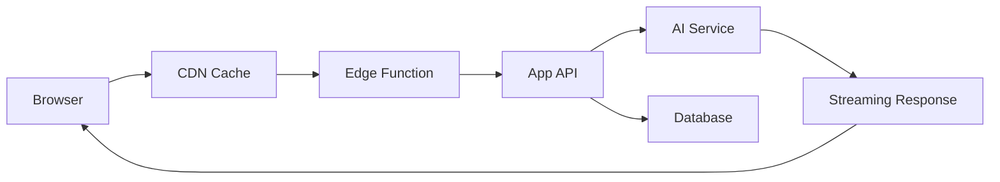

## AI features can make websites feel slower

Modern websites are becoming more interactive. They include dashboards, animations, embedded assistants, document search, chat panels, and AI-generated content. These features can be powerful, but they can also slow down the user experience.

Performance is not only about Lighthouse scores. It is about how quickly users can understand, interact, and complete their task.

## Start with the critical path

The first screen should load fast. Do not block the entire page because an AI assistant, analytics chart, or optional widget is still loading.

A good rule:

- Load the core page first.
- Defer heavy widgets.
- Stream AI responses.
- Cache repeated requests.
- Keep animations lightweight.

## AI response streaming

When an AI response takes time, streaming improves perceived speed. Instead of waiting for the full answer, show partial output as it arrives. This makes the interface feel alive and reduces user frustration.

But streaming should be designed carefully. Show loading states, allow cancelation, and handle errors cleanly.

## Lazy load heavy features

Not everything needs to be in the first JavaScript bundle. Lazy load:

- Code editors.
- Charts.
- 3D viewers.
- AI chat panels.
- Large modals.
- Admin-only tools.

This keeps the initial page lighter.

## Cache intelligently

Caching is one of the simplest ways to improve performance. Cache static assets, API responses, embeddings when appropriate, and generated summaries that do not change often.

For AI apps, caching can also reduce cost. If multiple users ask for the same generated explanation, you may not need to regenerate it every time.

## Edge and serverless patterns

Running logic closer to users can reduce latency. Edge functions and serverless AI platforms can be useful for lightweight inference, routing, personalization, and fast API responses.

The tradeoff is that not every workload belongs at the edge. Heavy tasks, long-running jobs, and complex database operations may still belong in regional services or queues.

## Measure what matters

Track normal web performance:

- Largest Contentful Paint.
- Interaction to Next Paint.
- Cumulative Layout Shift.
- JavaScript bundle size.
- API latency.

For AI features, also track:

- Time to first token.
- Time to complete answer.
- Model cost per request.
- Retrieval latency.
- User cancel rate.

## Example performance architecture

## Practical checklist

- Keep the landing page bundle small.
- Use image optimization.
- Lazy load non-critical components.
- Stream long AI outputs.
- Cache stable data.
- Move long AI tasks to queues.
- Monitor both user speed and AI cost.
- Design clear loading and error states.

## Key takeaways

- AI features should not block the core page.
- Streaming improves perceived performance.
- Lazy loading is essential for rich web apps.
- Caching improves both speed and cost.
- Measure AI-specific latency, not only web vitals.

## FAQ

**Should every AI response stream?**
Not always. Stream long responses. For short classifications or quick actions, a normal response is fine.

**Does edge solve all performance problems?**
No. Edge helps latency-sensitive tasks, but heavy workloads still need proper backend architecture.

**What is the easiest performance win?**
Reduce the initial JavaScript bundle and lazy load expensive components.

## Conclusion

AI-era web performance is about balance. Give users the page quickly, load heavy features only when needed, stream slow outputs, and measure the cost of intelligence. A fast AI app feels helpful, not heavy.
